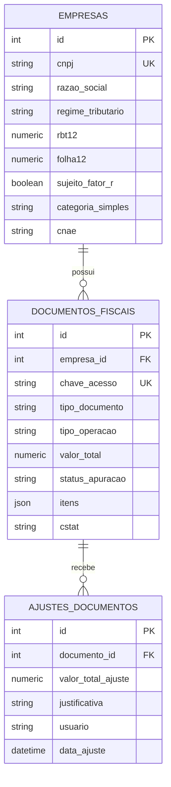
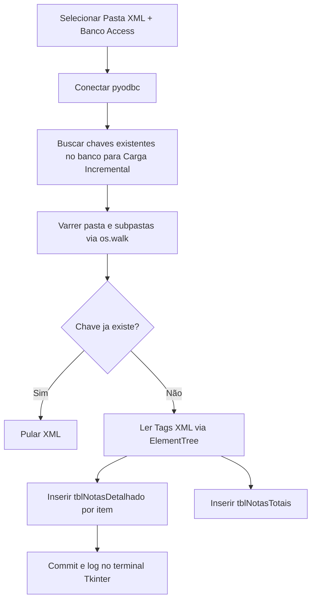

# Mapeamento do Projeto: Conversor de XML e Workflow Fiscal

Este documento fornece um mapeamento completo e detalhado da aplicação. Ele foi projetado especificamente para que você (ou qualquer outra inteligência artificial em um novo chat) possa compreender instantaneamente a arquitetura do sistema, a estrutura de arquivos, os esquemas de banco de dados e os fluxos de trabalho, garantindo uma continuidade perfeita do desenvolvimento.

---

## 🛠️ 1. Visão Geral do Sistema

A aplicação é um **ecossistema de processamento e apuração de documentos fiscais (NF-e e NFC-e)** baseados no padrão XML brasileiro. Ela opera sob uma arquitetura híbrida de dois subsistemas:

1. **Subsistema Desktop (Integração MS Access)**:
   - Utiliza scripts Python (`importador_nfe.py`, `extrator_mva.py`) com interface gráfica local em **Tkinter**.
   - Lê arquivos XML de NF-e locais, extrai cabeçalhos, produtos e impostos, e os insere em um banco de dados **Microsoft Access (`.accdb` / `.mdb`)**.
   - Faz o download automático e a raspagem inteligente de PDFs de decretos da **SEFAZ-BA** para extrair alíquotas de Margem de Valor Agregado (MVA), salvando-as no Access para subsidiar cálculos de Substituição Tributária (ST).

2. **Subsistema Web API (Staging Area & Motor Fiscal)**:
   - Desenvolvido em **FastAPI** (Python) com suporte a banco de dados **SQLite** local ou **PostgreSQL** (local ou em nuvem via Neon) configurado por variáveis de ambiente.
   - Fornece uma **Staging Area** (Área de Preparação) onde notas fiscais são importadas e podem ser editadas, auditadas e ter ajustes manuais registrados de forma rastreável.
   - Roda um Motor de Cálculo Dinâmico (Strategy Pattern) para simulação e apuração de tributos sob diferentes regimes (Simples Nacional - Anexos I, II [Indústria], III, IV e V [Fator R]; e Lucro Presumido - Prestação de Serviços).
   - Apresenta um **Painel de Controle Visual (Dashboard)** interativo e moderno incorporado diretamente no backend, contendo um visualizador de terminal de logs em tempo real integrado.

---

## 📁 2. Arquitetura e Estrutura de Pastas

A estrutura física do repositório é organizada de forma modular:

```text
Conversor_de_Xml_Nfe/
├── .env                             # Configuração ativa local (ex: conexão PostgreSQL local)
├── .env.example                     # Modelo de variáveis de ambiente (ex: DATABASE_URL)
├── .gitignore                       # Filtros de arquivos para controle de versão
├── Atualizar_Notas.bat              # Script batch para automação de tarefas de importação
├── Iniciar_Workflow_Fiscal.bat      # Script batch para iniciar a API FastAPI e abrir o Dashboard
├── Iniciar_Workflow_Fiscal_Silencioso.vbs # VBScript para inicializar o servidor de forma oculta/silenciosa
├── Instruções para gerar o exe...   # Guia técnico para compilar o script Desktop em .exe usando PyInstaller
├── LEIAME                           # Manual rápido de receitas para inclusão de novos campos no Access/Python
├── extrator_mva.py                  # Script de raspagem (scraping) de PDFs de MVA da SEFAZ-BA
├── importador_nfe.py                # Interface GUI e motor de carga de XML no banco Access
├── importador_nfe.spec              # Configuração de build do PyInstaller para o executável Desktop
├── splash.png                       # Tela de carregamento (splash screen) do executável compilado
│
└── fiscal_workflow/                 # Diretório principal da Web API e Staging Area
    ├── main.py                      # Ponto de entrada FastAPI (Endpoints, roteamento, migrações em runtime)
    │
    ├── core/                        # Configurações globais e templates visuais
    │   ├── cnae_data.json           # Dados locais de CNAE desmembrados com regras tributárias
    │   ├── config.py                # Leitura de variáveis do .env e conexões de fallback
    │   └── dashboard_template.py    # Código HTML/CSS/JS do Dashboard integrado (seletor dinâmico de CNAE)
    │
    ├── db/                          # Camada de persistência e conexões
    │   └── database.py              # Sessão SQLAlchemy (gerenciamento do pool de conexões)
    │
    ├── models/                      # Definição dos modelos ORM
    │   └── models.py                # Modelos relacionais (Empresa, DocumentoFiscal, AjusteDocumento)
    │
    ├── schemas/                     # Validação e serialização de dados
    │   └── schemas.py               # Esquemas Pydantic para entrada/saída de endpoints
    │
    ├── services/                    # Regras de negócios e lógica procedural
    │   ├── calculadoras.py          # Motor tributário baseado no padrão de projeto Strategy
    │   ├── cnae_syncer.py           # Sincronizador de CNAEs com a API de Subclasses do IBGE
    │   ├── cnpj_client.py           # Cliente HTTP para consulta de CNAE oficial via API CNPJ.ws
    │   └── parsers.py               # Leitor e normalizador de XML usando biblioteca lxml
    │
    └── tests/                       # Esteira de testes automatizados
        ├── test_api.py              # Testes dos endpoints HTTP da API
        ├── test_calculadoras.py     # Testes unitários do motor fiscal
        ├── test_models.py           # Testes dos relacionamentos e propriedades do SQLAlchemy
        └── test_parsers.py          # Testes do analisador de XML (cstat, tags, itens)
```

---

## 🗄️ 3. Mapeamento de Bancos de Dados

O ecossistema utiliza dois formatos de persistência de dados distintos.

### A. Banco de Dados Microsoft Access (Subsistema Desktop)
O arquivo padrão esperado é o `Base_NF_ENTRADA.accdb`, composto pelas seguintes tabelas principais:

#### 1. `tblNotasDetalhado` (Itens individuais das notas)
Armazena a decomposição de cada item (produto) presente no XML das NF-es.
* **Chave_NFe** (Texto): Chave de acesso única da nota (44 dígitos).
* **Periodo** (Texto): Identificador do período fiscal (normalmente derivado da pasta de importação, ex: `04-2026`).
* **Numero_NF** (Texto): Número da Nota Fiscal.
* **Data_Emissao** (Data/Hora): Data de emissão da nota.
* **Emitente_CNPJ** / **Emitente_Nome** / **Emitente_UF** / **Emitente_IE** / **Emitente_CRT** (Texto): Dados cadastrais do fornecedor.
* **Destinatario_CNPJ** / **Destinatario_Nome** / **Destinatario_UF** (Texto): Dados do cliente/recebedor.
* **Produto_cProd** / **Produto_xProd** / **Produto_cEAN** / **CEST** / **Produto_NCM** / **Produto_CFOP** / **Unidade** (Texto): Detalhes do item.
* **Produto_qCom** / **Produto_vUnCom** / **Produto_vProd** / **Produto_vDesc** / **Produto_vFrete** (Duplo/Moeda): Quantidades e valores monetários.
* **vIPI** / **ICMS_CST** / **ICMS_Item_vBC** / **ICMS_Item_pICMS** / **ICMS_Item_vICMS** (Duplo/Moeda): Campos tributários de IPI e ICMS padrão.
* **ICMS_Item_pCredSN** / **ICMS_Item_vCredICMSSN** (Duplo/Moeda): Campos específicos para crédito do Simples Nacional.
* **ICMS_pMVAST** / **vBC_ST** / **pICMSST** / **vICMSST** / **vBCFCPSTRet** / **pFCPSTRet** (Duplo): Campos de Substituição Tributária (ST) e Fundo de Combate à Pobreza.
* **PIS_CST** / **PIS_vBC** / **PIS_pPIS** / **vPIS** (Texto/Duplo): Campos de PIS.
* **COFINS_CST** / **COFINS_vBC** / **COFINS_pCOFINS** / **vCOFINS** (Texto/Duplo): Campos de COFINS.
* **cStat** (Texto): Código de status do protocolo da nota (ex: `100` para autorizada, `101` para cancelada).

#### 2. `tblNotasTotais` (Resumo da Capa da Nota)
Guarda os valores consolidados por documento XML.
* **Chave_NFe** (Texto - Chave Primária), **Periodo**, **Numero_NF**, **Data_Emissao**, **Emitente_CNPJ**, **Emitente_Nome**.
* **vBC**, **vICMS**, **vBCST**, **vST**, **vFCP**, **vPIS**, **vCOFINS**, **vNF** (Moeda/Duplo): Somatórios das tags da capa da nota.

#### 3. `tblMVA_Bahia` (Parâmetros tributários estaduais)
Alimentada pelo script de scraping de decretos da SEFAZ-BA.
* **ITEM** (Texto): Código numérico do item no decreto (ex: `1.1`).
* **CEST** (Texto), **NCM** (Texto).
* **NCM_INICIAL** / **NCM_FINAL** (Texto): Faixas de busca para enquadramento por substring.
* **MVA_ORIGINAL** / **MVA_AJUSTADA_4** / **MVA_AJUSTADA_7** / **MVA_AJUSTADA_12** (Duplo): Percentuais de MVA.
* **DESCRIÇÃO** (Memo/Texto Longo): Descrição legal do grupo de mercadorias.

---

### B. Banco de Dados Relacional SQLAlchemy (Subsistema Web API)
Mapeado em `fiscal_workflow/models/models.py`. O sistema utiliza por padrão o SQLite local (`fiscal_workflow.db`), mas está totalmente configurado para rodar em **PostgreSQL** (local ou em nuvem) quando a variável `DATABASE_URL` estiver definida no arquivo `.env`.



#### Regras Importantes do Modelo:
- **`Empresa.cnae`**: Armazena o código de 7 dígitos do CNAE principal da empresa. O sistema agora resolve o autocomplete e a descrição dinamicamente através da API `/api/cnaes` (alimentada localmente por `cnae_data.json` e auto-atualizável via IBGE com `cnae_syncer.py`), configurando automaticamente o Regime, Categoria/Anexo e Fator R.
- **`Empresa.regime_tributario`**: Armazena strings estritas do enum `RegimeTributario` (`Simples Nacional`, `Lucro Presumido`, `Lucro Real`).
- **`DocumentoFiscal.valor_final`** (Propriedade Calculada): Retorna dinamicamente a soma matemática `valor_total + sum(ajustes.valor_total_ajuste)`.
- **`DocumentoFiscal.status_apuracao`**: Armazena strings do enum `StatusApuracao` (`Pendente`, `Em Revisão`, `Encerrado`).
- **`DocumentoFiscal.itens`**: Coluna do tipo **JSON** que armazena toda a árvore de produtos, quantidades, NCM e tags internas extraídas do XML pelo parser para viabilizar auditorias detalhadas e recálculos por alíquota sem necessidade do arquivo XML físico original.

---

## ⚙️ 4. Fluxos de Trabalho Principais

### Fluxo A: Carga Desktop para Access


### Fluxo B: Staging Area e Apuração Fiscal (API)
1. **Upload / Ingestão**: O endpoint `/documentos/upload` recebe múltiplos XMLs. Ele faz o parse de cada um de maneira resiliente.
   - Se o CNPJ do emitente da nota **não existe** no banco de dados, o sistema **autocadastra** a empresa com base no CRT (Código de Regime Tributário) informado na nota (CRT 1/2 = Simples Nacional, CRT 3 = Lucro Presumido).
   - Se o documento já existe, mas o XML traz um status diferente (ex: cancelamento), o campo `cstat` é atualizado na Staging Area.
2. **Auditoria e Ajustes Manuais**: No Dashboard, fiscais podem registrar ajustes monetários em `/documentos/{id}/ajustes` (ex: glosas, estornos, exclusões judiciais de bases de cálculo). O status do documento muda automaticamente para `Em Revisão` e bloqueia novas alterações caso o período esteja `Encerrado`.
3. **Motor de Cálculo (Strategy Pattern)**: Quando `/documentos/{id}/apurar` é chamado:
   - A `CalculadoraFactory` identifica o Regime Tributário da empresa associada.
   - Se **Simples Nacional**:
     - Calcula a **alíquota efetiva** dinâmica a partir do Faturamento Acumulado (RBT12), da Folha de Salários e da regra do **Fator R** (Anexo III vs Anexo V) ou enquadramento explícito (Anexo I, II, III, IV ou V).
     - **Anexo I (Comércio) & Anexo II (Indústria)**: Analisa os itens JSON do documento. Se houver produtos com Substituição Tributária de ICMS (CSTs de ST/CSOSN 500), calcula a **Segregação de ST** com base na fração de partilha tributária do ICMS (Anexo I ou Anexo II) para deduzir o imposto e gerar economia fiscal real. O Anexo II também calcula e destaca a partilha fixa do **IPI (7,50%)**.
     - **Anexo IV & Anexo V**: Calcula a dedução de ISS Retido na fonte usando as frações de partilha específicas (Anexo IV: 44,5% a 40%; Anexo V: 14% a 23,33%). Para o Anexo IV, a **CPP (INSS Patronal)** de 20% sobre a folha é excluída do DAS, emitindo um lembrete previdenciário no Dashboard.
   - Se **Lucro Presumido**:
     - Executa a presunção federal clássica para serviços (Presunção de 32% base de cálculo): **PIS (0,65%)**, **COFINS (3,00%)**, **IRPJ (4,80%)** e **CSLL (2,88%)**.
   - Se a nota fiscal possuir `cstat` de **Cancelamento ou Denegação** (`101`, `110`, `301`, `302`), o faturamento e os impostos são zerados automaticamente, emitindo uma mensagem de alerta.

---

## 🚀 5. Manual de Continuidade para Novas Sessões de Chat

Se você está assumindo este projeto em um novo chat, siga estas etapas para rodar e testar imediatamente:

### Passo 1: Preparar o Ambiente Virtual e Dependências
Abra o terminal na pasta raiz do projeto e crie/ative o ambiente virtual Python:
```powershell
# Criação do ambiente virtual
python -m venv .venv

# Ativação no Windows (PowerShell)
.venv\Scripts\Activate.ps1

# Instalação das dependências necessárias
pip install fastapi uvicorn sqlalchemy pydantic pdfplumber pandas requests pyodbc lxml pytest psycopg2-binary
```

### Passo 2: Executar a API Web e Dashboard
Para iniciar o servidor web local e acessar o Dashboard interativo, execute o arquivo batch fornecido ou execute diretamente pelo terminal:
```powershell
# Executando silenciosamente em segundo plano (Recomendado)
Iniciar_Workflow_Fiscal_Silencioso.vbs

# Executando via batch script (com janela do console aberta)
.\Iniciar_Workflow_Fiscal.bat

# OU rodando manualmente via terminal
$env:PYTHONPATH="."
uvicorn fiscal_workflow.main:app --reload --port 8000
```
O sistema abrirá a Staging Area e Dashboard automaticamente no seu navegador padrão em: **`http://127.0.0.1:8000/`**.

### Passo 3: Rodar a Suíte de Testes
Para garantir que nenhuma modificação recente quebrou as regras fiscais complexas ou a leitura de XMLs, execute o Pytest:
```powershell
# Rodar todos os testes de API, calculadoras, modelos e parsers
pytest -v
```

### Passo 4: Executar a GUI Desktop para Carga no Access
Se você precisa carregar uma pasta de XMLs para uma base Access local ou rodar o extrator de MVA da Bahia:
```powershell
python importador_nfe.py
```
*(Nota: Certifique-se de ter o driver de Access de 64 bits ou 32 bits correspondente à versão instalada do Python em sua máquina para que o `pyodbc` consiga conectar).*

---

## 📈 6. Próximos Passos Sugeridos para Desenvolvimento

Se você está se perguntando por onde continuar, aqui estão as principais frentes de melhoria planejadas para o projeto:
1. **Implementar a Calculadora de Lucro Real**: Criar a classe concreta `CalculadoraLucroReal(CalculadoraInterface)` no motor fiscal para cobrir apurações não-cumulativas de PIS/COFINS (1,65% e 7,6% com sistema de créditos físicos/tributários sobre insumos).
2. **Filtros Avançados por Período no Dashboard**: Adicionar seletores de período fiscal (Mês/Ano) no Dashboard HTML para consolidar impostos por competência mensal fechada, além de filtros por Regime de Caixa vs Competência.
3. **Exportação de Relatórios**: Criar endpoints para geração e download de relatórios consolidados de apuração e auditoria de staging em formatos Excel (XLSX) e PDF.
4. **Tratamento de Alíquotas de ISS no Simples Nacional**: Permitir que o usuário informe a alíquota municipal de ISS (entre 2% e 5%) de forma customizada para a apuração de serviços no Simples Nacional (Anexos III e V), segregando-a do DAS padrão.
